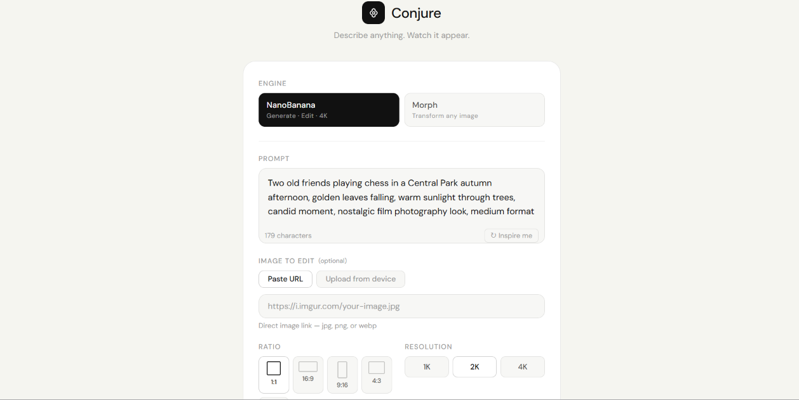
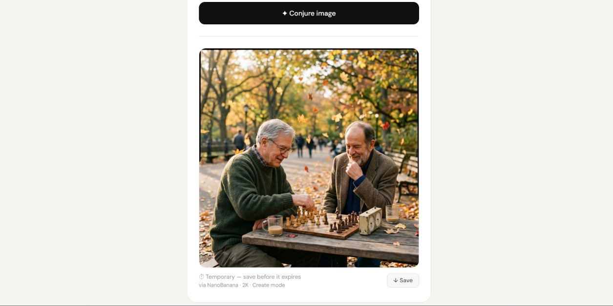

# Conjure ✦

> **Summon anything into existence.**  
> A multi-engine AI image generation and editing web app — built with vanilla JS, deployed serverlessly on Vercel.

🔗 **Live Demo:** [tryconjure.vercel.app](https://tryconjure.vercel.app)

---

## Screenshots

<p>
  
  
</p>

---

## What it does

Conjure lets you generate and transform images using multiple AI engines from a single clean interface. Type a prompt, pick an engine, and watch it appear.

- **Generate** original images from text prompts
- **Edit** existing images by describing changes in plain English
- **Transform** any image into a completely different style or aesthetic
- **Upload** local images directly — no manual hosting required

---

## Engines

| Engine | Type | Capability |
|--------|------|------------|
| **NanoBanana** | Generate + Edit | Text-to-image, image editing, up to 4K resolution, 5 aspect ratios |
| **Morph** | Transform | Style transfer — turn any image into watercolor, cyberpunk, anime, oil painting, and more |

---

## Architecture

```
Browser (index.html)
    │
    ├── /api/generate.js   → NanoBanana API proxy
    ├── /api/morph.js      → Morph/Visco API proxy
    └── /api/upload.js     → imgbb upload proxy (API key never exposed)
```

All third-party API calls go through **Vercel serverless functions** — no API keys are ever sent to or exposed in the browser.

---

## Tech Stack

| Layer | Technology |
|-------|-----------|
| Frontend | Vanilla HTML, CSS, JavaScript |
| Deployment | Vercel (serverless) |
| API Proxies | Vercel Serverless Functions (Node.js) |
| Image Hosting | imgbb API |
| Font | DM Sans via Google Fonts |

No frameworks. No build step. No dependencies on the client side.

---

## Features

- **Side-by-side layout on desktop** — controls on the left, generated image on the right, no scrolling needed
- **Dynamic prompt suggestions** — 30+ curated prompts per engine, never repeats until the pool is exhausted
- **Smart edit mode** — ratio and resolution controls auto-hide when an image is provided, preventing watermarked output
- **Dual image input** — paste a URL or upload directly from device (auto-uploaded to imgbb, public URL passed to AI)
- **Required field enforcement** — engines that need an image (Morph) validate before sending requests
- **Live status indicators** — upload progress, generation progress, success/failure states
- **Save to device** — one-click download of generated images
- **Responsive** — desktop gets split layout, mobile gets clean single-column view
- **Security** — API keys stored in Vercel environment variables only, never in client code

---

## Project Structure

```
/
├── index.html              # App UI and logic
├── style.css               # All custom styles
├── vercel.json             # Vercel config (function timeouts)
├── package.json            # Project metadata
├── .gitignore
├── screenshots/
│   ├── home.png
│   └── result.png
└── api/
    ├── generate.js         # NanoBanana proxy
    ├── morph.js            # Morph image transform proxy
    └── upload.js           # imgbb upload proxy
```

---

## Local Setup

```bash
# 1. Clone the repo
git clone https://github.com/HashtagAnkit/conjure.git
cd conjure

# 2. Install Vercel CLI
npm install -g vercel

# 3. Add your environment variable
echo "IMGBB_KEY=your_imgbb_api_key_here" > .env.local

# 4. Run locally
vercel dev
```

> Get a free imgbb API key at [imgbb.com/api](https://imgbb.com/api)

---

## Environment Variables

| Variable | Where to get it | Used in |
|----------|----------------|---------|
| `IMGBB_KEY` | [imgbb.com/api](https://imgbb.com/api) — free | `api/upload.js` |

Set this in your Vercel project under **Settings → Environment Variables**.

---

## API Integrations

| API | Purpose | Auth |
|-----|---------|------|
| [NanoBanana](https://zecora0.serv00.net) | Image generation + editing | None (public) |
| [Visco Image Edit](https://viscodev.x10.mx) | Style transformation | None (public) |
| [imgbb](https://imgbb.com/api) | Image hosting for uploads | API key (server-side only) |

---

## Why Serverless Proxies?

Third-party AI APIs don't send CORS headers, which means browsers block direct calls. Rather than using a public CORS proxy (unreliable, exposes endpoints), each API has a dedicated Vercel serverless function that:

1. Receives the request from the browser
2. Forwards it server-side to the actual API
3. Returns the response with proper CORS headers

This also keeps API keys out of client-side code entirely.

---

## What I learned building this

- Serverless function architecture for API proxying and secret management
- CORS — why it exists, when it blocks requests, and how to handle it properly
- imgbb integration for converting local file uploads into public URLs
- UX decisions around API limitations (watermark avoidance, required field logic)
- Deploying and managing environment variables on Vercel
- Responsive layout design — desktop split view vs mobile single column

---

<p align="center">Built by <a href="https://github.com/HashtagAnkit">@HashtagAnkit</a></p>
